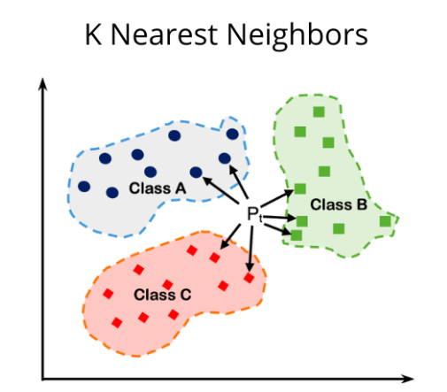
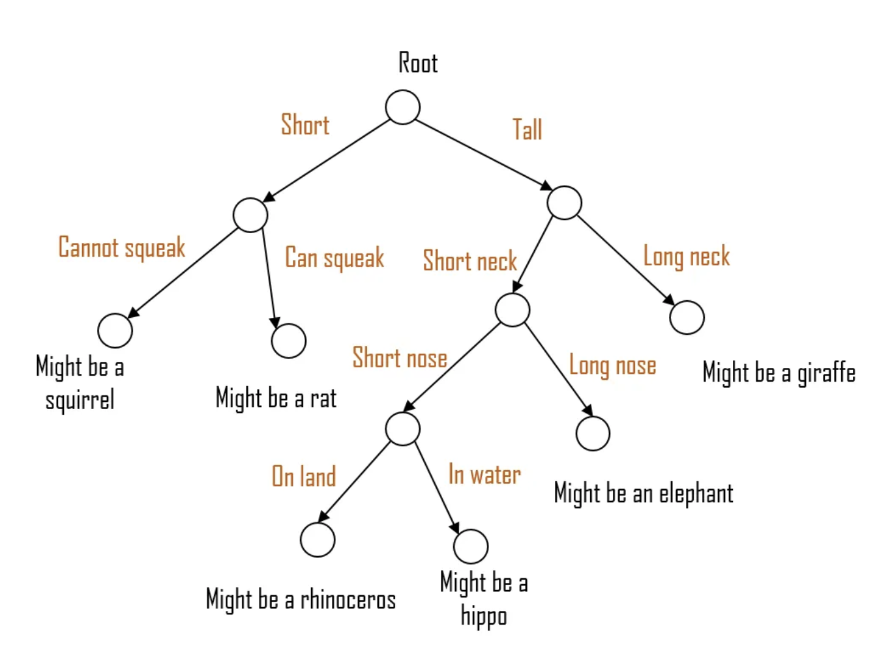
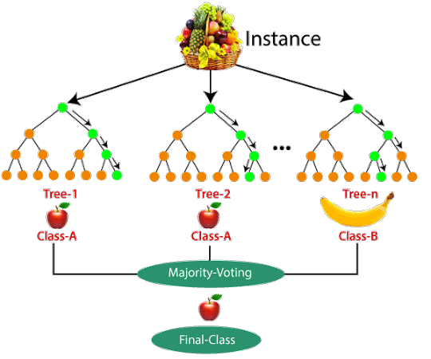
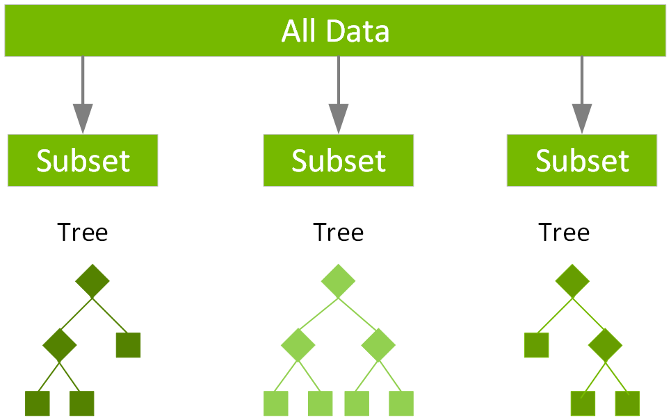
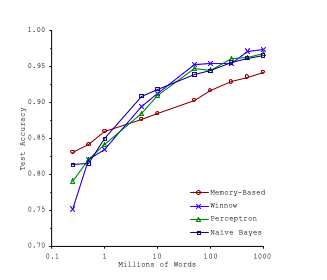

# Machine Learning Algorithm category

| Category        |  Explain  | Scenarios           |
| ------------- |:-------------:|----------|
| Supervised Learning | Training data is labeled | Auto Driving   Image Recognization |
| UnSupervised Learning | Training Data is not labeled | Clustering   Anomaly detection   Dimensionality Reduction |
| Semi-Supervised Learning | Trained on labeled and unlabeled data | self-training   co-training |
| Reinforcement Learning | Adjust according to feedback to gain maximum reword | game playing   Reward such as Finance   natural language process |

# Machine Learning Algorithms

| Name          |  Category     | Detail        | Scenarios  |
| ------------- |:-------------:|:-------------:|-----------|
| Linear Regression | Supervised | Continous Regression Line |  |
| Logistic Regression | Supervised | Yes - No | Binary Classification   Medication Dignosis   Political Forecasting |
| Naive Bayes |  Supervised | Based on Bayes-theory | |
| Decision Tree | Supervised | |
| Random Forest | Supervised | Use a set of sub-forest to vote |
| KNN - K-Nearest Neighbor | Supervised | Use the K nearst neighbor to decide where it belongs | classification |
| K-means | Unsupervised | Use a 'center' to define each cluster | Clustering |
| SVM - Supported Vector Machine | Supervised |  | Classification and regression |
| XGBoost | Supervised | Large dataset,  complex problems | classification   Regression   Feature selecion   abnormal detection   natural language processing   feature selection |

# Popular Machine Learning library

| Library          |  Short Description     |
| ------------- | ----------- |
| Scikit-Learn | Traditional Machine Learning Algorithms, such as XGBoost |
| TensorFlow | Deep Learning Framework |
| Pytorch |  |   |
| Keras | Deep Learning Library | Popular choice and supported multiple platform |
| Numpy | Numeric computing |  |
| Matplotlib | Visualize 2-D data |
| Pandas | Read and Analysis structured data |

### Linear Regression

### SVM

### KNN

### K-means

### Decision Tree

### Random Forest

### XGBoost

# Importance of data versus algorithms

# Real Datasets
* OpenML.org - openml.org
* Kaggle.com - kaggle.com/datasets
* PapersWithCode.com - paterswithcode.com/datasets
* UC Irvine Machine Learning Repository - archive.ics.uci.edu/ml
* Amazon's AWS datasets - registry.opendata.aws
* TensorFlow datasets - tensorflow.org/datasets

# ChatGPT
* How does chatGPT works - https://writings.stephenwolfram.com/2023/02/what-is-chatgpt-doing-and-why-does-it-work/
